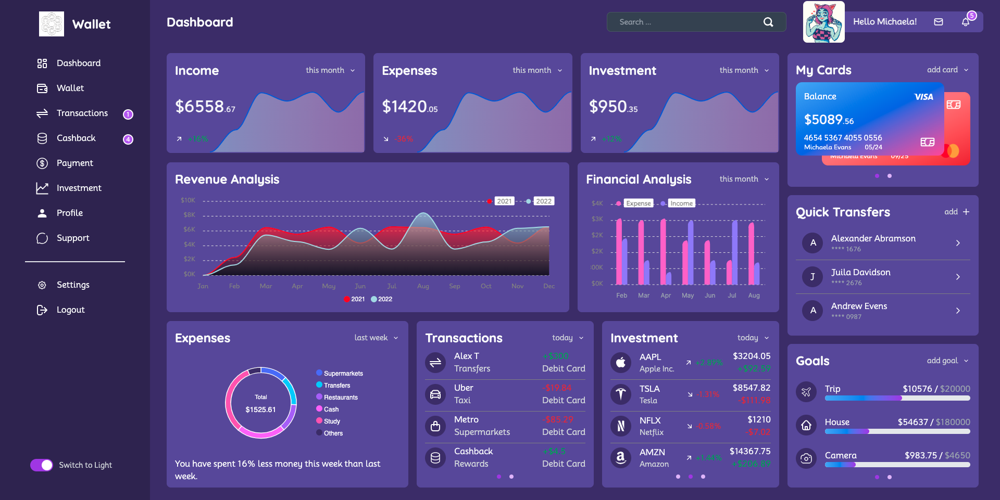

<a name="readme-top"></a>

<!--
!!! IMPORTANT !!!
This README is an example of how you could professionally present your codebase.
Writing documentation is a crucial part of your work as a professional software developer and cannot be ignored.

You should modify this file to match your project and remove sections that don't apply.

REQUIRED SECTIONS:
- Table of Contents
- About the Project
  - Built With
  - Live Demo
- Getting Started
- Authors
- Future Features
- Contributing
- Show your support
- Acknowledgements
- License

OPTIONAL SECTIONS:
- FAQ

After you're finished please remove all the comments and instructions!

For more information on the importance of a professional README for your repositories: https://github.com/microverselc/microverse/blob/main/curriculum/transversal-skills/documentation/articles/readme_best_practices.md
-->

<div align="center">
  <h3><b>LegacyFA Dashboard</b></h3>
</div>

<!-- TABLE OF CONTENTS -->

# 📗 Table of Contents

- [📖 About the Project](#about-project)
  - [Screenshots](#screenshots)
  - [🛠 Built With](#built-with)
    - [Tech Stack](#tech-stack)
    - [Key Features](#key-features)
  - [🚀 Live Demo](#live-demo)
  - [ERD Diagram](#erd-diagram)
- [💻 Getting Started](#getting-started)
  - [Prerequisites](#prerequisites)
  - [Setup](#setup)
  - [Install](#install)
  - [Usage](#usage)
  - [Run tests](#run-tests)
  - [Deployment](#deployment)
- [👥 Authors](#authors)
- [🔭 Future Features](#future-features)
- [🤝 Contributing](#contributing)
- [⭐️ Show your support](#support)
- [🙏 Acknowledgements](#acknowledgements)
- [❓ FAQ (OPTIONAL)](#faq)
- [📝 License](#license)

<!-- PROJECT DESCRIPTION -->

# 📖 Legacy-FA-Dashboard (Screen Size: 1920x1080) <a name="about-project"></a>

> Describe your project in 1 or 2 sentences.

**Legacy-FA-Dashboard** is an assignment given to me by [LegacyFA](https://www.legacyfa-asia.com/) to display my frontend skills.

## [Pull Request](https://github.com/rex-9/LegacyFA/pull/1)

## Screenshots <a name="screenshots"></a>

- Dark Theme
  

- Light Theme
  

## 🛠 Built With <a name="built-with"></a>

### Tech Stack <a name="tech-stack"></a>

> Describe the tech stack and include only the relevant sections that apply to your project.

<details>
  <summary>Client</summary>
  <ul>
    <li><a href="https://reactjs.org/">React.js</a></li>
    <li><a href="https://www.typescriptlang.org/">Typescript.js</a></li>
    <li><a href="https://vitejs.dev/">Vite.js</a></li>
    <li><a href="https://tailwindcss.com/">TailwindCSS</a></li>
  </ul>
</details>

<details>
  <summary>Server (Planning)</summary>
  <ul>
    <li><a href="https://rubyonrails.org/">Ruby on Rails</a></li>
  </ul>
</details>

<details>
<summary>Database</summary>
  <ul>
    <li><a href="https://www.postgresql.org/">PostgreSQL</a></li>
  </ul>
</details>

<!-- Features -->

### Key Features <a name="key-features"></a>

- **Beautiful Admin Dashboard**

<p align="right">(<a href="#readme-top">back to top</a>)</p>

<!-- LIVE DEMO -->

## 🚀 Live Demo <a name="live-demo"></a>

> Add a link to your deployed project.

- [Live Demo Link](https://legacy-fa-dashboard.vercel.app/)

<p align="right">(<a href="#readme-top">back to top</a>)</p>

## ERD Diagram (simplified) <a name="erd-diagram"></a>

- Postgres Database
  

- [Visit Diagram](https://drawsql.app/teams/rex9/diagrams/legacyfa)

<!-- GETTING STARTED -->

## 💻 Getting Started <a name="getting-started"></a>

> Describe how a new developer could make use of your project.

To get a local copy up and running, follow these steps.

### Prerequisites

In order to run this project you need download [Node.js](https://nodejs.org/en):

Check your node installation is complete.

```sh
  node --version
```

### Setup

Clone this repository or download as a zip file to your desired folder:

```sh
  cd my-folder
  git clone git@github.com:rex-9/LegacyFA.git
```

### Install

Install this project with:

```sh
  cd LegacyFA
  npm install
```

### Usage

To run the project, execute the following command:

```sh
  npm run dev
```

### Run tests

To run eslint tests, run the following command:

```sh
  npx eslint .
```

To run stylelint tests, run the following command:

```sh
  npx stylelint "**/*.{css,scss}"
```

<p align="right">(<a href="#readme-top">back to top</a>)</p>

<!-- AUTHORS -->

## 👥 Authors <a name="authors"></a>

> Mention all of the collaborators of this project.

👤 **Htet Naing (Rex)**

- GitHub: [@rex-9](https://github.com/rex-9)
- Bento: [@rex9](https://bento.me/rex9)
- LinkedIn: [@rex9](https://linkedin.com/in/rex9)

<p align="right">(<a href="#readme-top">back to top</a>)</p>

<!-- FUTURE FEATURES -->

<!-- ## 🔭 Future Features <a name="future-features"></a>

> Describe 1 - 3 features you will add to the project.

- [ ] **[new_feature_1]**
- [ ] **[new_feature_2]**
- [ ] **[new_feature_3]**

<p align="right">(<a href="#readme-top">back to top</a>)</p> -->

<!-- CONTRIBUTING -->

## 🤝 Contributing <a name="contributing"></a>

Contributions, issues, and feature requests are welcome!

Feel free to check the [issues page](../../issues/).

<p align="right">(<a href="#readme-top">back to top</a>)</p>

<!-- SUPPORT -->

## ⭐️ Show your support <a name="support"></a>

> Write a message to encourage readers to support your project

If you like this project, please remember me, Rex9.

<p align="right">(<a href="#readme-top">back to top</a>)</p>

<!-- ACKNOWLEDGEMENTS -->

## 🙏 Acknowledgments <a name="acknowledgements"></a>

> Give credit to everyone who inspired your codebase.

I would like to thank [LegacyFA](https://www.legacyfa-asia.com/) for this wonderful challenge.

<p align="right">(<a href="#readme-top">back to top</a>)</p>

<!-- FAQ (optional) -->

<!-- ## ❓ FAQ (OPTIONAL) <a name="faq"></a>

> Add at least 2 questions new developers would ask when they decide to use your project.

- **[Question_1]**

  - [Answer_1]

- **[Question_2]**

  - [Answer_2]

<p align="right">(<a href="#readme-top">back to top</a>)</p> -->

<!-- LICENSE -->

## 📝 License <a name="license"></a>

This project is [MIT](./LICENSE) licensed.

<!--
_NOTE: we recommend using the [MIT license](https://choosealicense.com/licenses/mit/) - you can set it up quickly by [using templates available on GitHub](https://docs.github.com/en/communities/setting-up-your-project-for-healthy-contributions/adding-a-license-to-a-repository). You can also use [any other license](https://choosealicense.com/licenses/) if you wish._ -->

<p align="right">(<a href="#readme-top">back to top</a>)</p>
